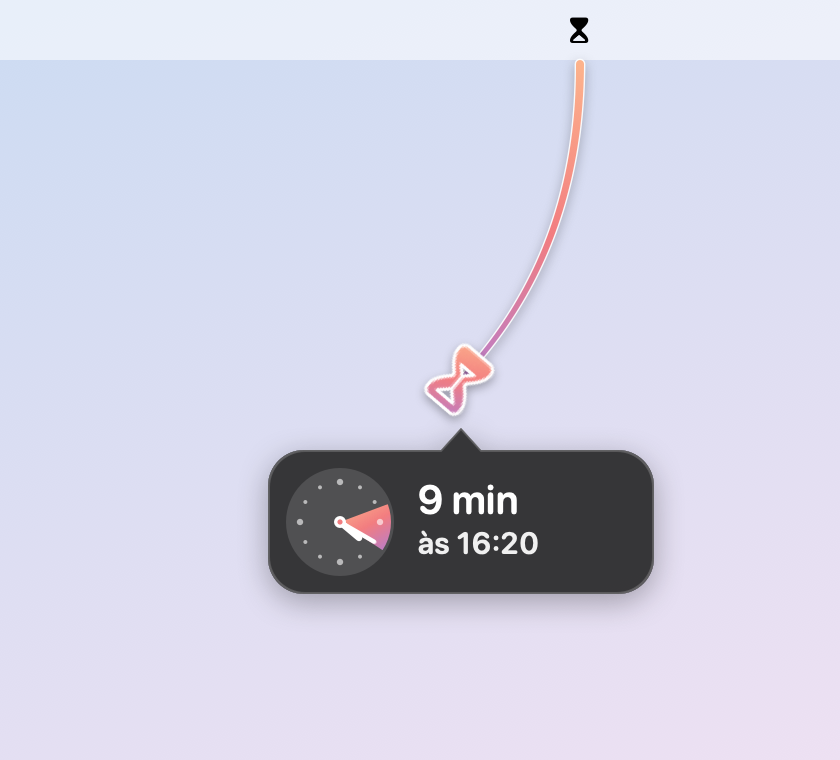
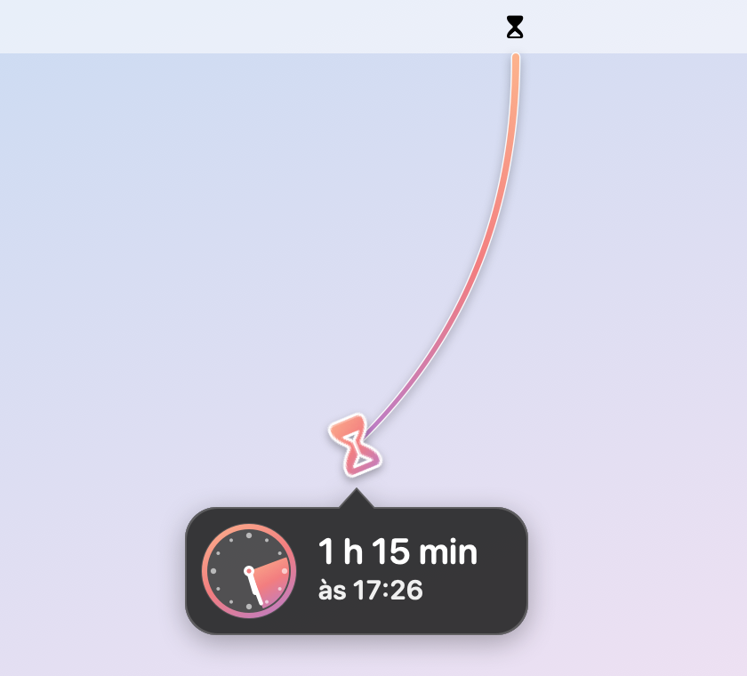

# ⏳ Ampulhetinha

Um timer que mora na barra de menus do Mac: **puxe a ampulheta para baixo, solte, dê um nome e pronto.**
Recriação nativa (Swift/AppKit + SwiftUI) do Gestimer 1, integrada ao app Lembretes.

<p align="center">
  
  
</p>

## Instalar

Com o [Homebrew](https://brew.sh):

```bash
brew tap victortabs/ampulhetinha https://github.com/victortabs/ampulhetinha
brew install --cask victortabs/ampulhetinha/ampulhetinha
```

Pronto: o app vai para `/Applications` e é só abrir. Funciona em Macs Apple Silicon e Intel, no macOS 14 (Sonoma) ou mais novo.

- Atualizar: `brew upgrade --cask ampulhetinha`
- Desinstalar: `brew uninstall --cask ampulhetinha` (com `--zap` apaga também timers e ajustes)

> O app não é assinado por um desenvolvedor registrado na Apple. O Homebrew já libera ele para abrir;
> se você baixar o `.zip` direto da página de [Releases](https://github.com/victortabs/ampulhetinha/releases),
> abra pela primeira vez com **botão direito → Abrir**.

## Como usar

- **Clique e arraste a ampulheta para baixo.** Quanto mais longe, mais tempo: os primeiros 400 pt valem 1 hora, depois cada 100 pt vale mais 1 hora.
  - As opções andam de **5 em 5 minutos** e, intercaladas, aparecem as que caem em **horário redondo**. Às 12:17, por exemplo: 3 min (12:20), 5 min (12:22), 8 min (12:25), 10 min (12:27)… Depois da primeira hora, de 15 em 15.
  - Segure **⌥** durante o arrasto para andar de **minuto em minuto**.
  - A ampulheta gira enquanto você puxa (22,5° a cada 5 min), e volta girando se você diminuir.
  - Volte até perto do ícone e solte para **cancelar**.
- Ao soltar, digite o título e tecle **↩**. **↑/↓** ajustam o tempo (±1 min, com ⇧ ±5 min). **esc** cancela. Clicar fora cria o timer com o que já foi digitado.
- **Clique** na ampulheta para ver a lista: adiar (+5), concluir, excluir, renomear (duplo clique no título), botão direito para mais opções. Timers terminados ficam em *Recentes*, com o botão **Repetir**.
- A notificação traz *Adiar 5 min / 15 min / 1 hora* e *Concluir*.

## App Lembretes

- Cada timer vira um lembrete (na lista padrão ou na lista escolhida nos Ajustes).
- Se você concluir, excluir, renomear ou mudar o horário do lembrete no app Lembretes (inclusive no iPhone), a Ampulhetinha acompanha.
- Os lembretes **com horário** dos próximos 7 dias aparecem na lista e na contagem da barra de menus.
- Opção *Alarme também no app Lembretes* para receber o aviso no iPhone/iPad.

## Compilar do código

Precisa do Xcode (ou só das Command Line Tools: `xcode-select --install`).

```bash
git clone https://github.com/victortabs/ampulhetinha.git
cd ampulhetinha
./Scripts/build.sh install
```

Isso compila, monta `build/Ampulhetinha.app`, instala em `/Applications` e abre o app.
Para atualizar: `git pull && ./Scripts/build.sh install`. Testes: `swift test`.

> A assinatura é ad-hoc, então a cada recompilação o macOS pode pedir de novo a permissão dos Lembretes.

### Publicar uma versão nova

1. Suba a versão em `Resources/Info.plist` (`CFBundleShortVersionString` e `CFBundleVersion`).
2. `./Scripts/build.sh release` gera `build/Ampulhetinha.zip` (universal) e mostra o SHA-256.
3. Atualize `version` e `sha256` em `Casks/ampulhetinha.rb`, faça o commit e o push.
4. `gh release create v<versão> build/Ampulhetinha.zip`

## Estrutura

| Arquivo | O quê |
|---|---|
| `StatusItemController.swift` | ícone na barra de menus, captura do gesto, popover |
| `DragOverlay.swift` | linha, ampulheta e balão com relógio desenhados durante o arrasto |
| `Panels.swift` | campo de título ao soltar e janela de alerta |
| `TimerStore.swift` | estado, persistência (`~/Library/Application Support/Ampulhetinha`), expiração, reconciliação |
| `RemindersSync.swift` | EventKit (app Lembretes) |
| `Notifications.swift` | notificações com ações |
| `Model.swift` | modelo, distância→tempo e degraus, formatação em português |
| `Views.swift` | lista e Ajustes (SwiftUI) |
| `Casks/ampulhetinha.rb` | receita do Homebrew |
